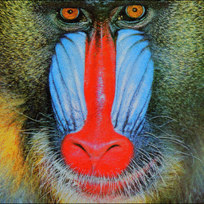

# pytorch-enhance: Image Super-Resolution in PyTorch
[](https://badge.fury.io/py/torch-enhance)


[](https://doi.org/10.5281/zenodo.3739368)

Library for Minimal Modern Image Super-Resolution in PyTorch


--------------------------------------------------------------------------------
PyTorch Enhance provides a consolidated package of popular Image Super-Resolution models, datasets, and metrics to allow for quick and painless benchmarking or for quickly adding pretrained models to your application.

## Documentation

[https://pytorch-enhance.readthedocs.io](https://pytorch-enhance.readthedocs.io)

## Installation

```
pip install torch-enhance
```


## Models
The following models are currently implemented:

* **SRCNN** from Dong et. al [Image Super-Resolution Using Deep Convolutional Networks](https://arxiv.org/pdf/1501.00092v3.pdf)
* **VDSR** from Lee et al. [Accurate Image Super-Resolution Using Very Deep Convolutional Networks](https://arxiv.org/pdf/1511.04587.pdf)
* **ESPCN** from Shi et. al [Real-Time Single Image and Video Super-Resolution Using an Efficient Sub-Pixel Convolutional Neural Network](https://arxiv.org/pdf/1609.05158v2.pdf)
* **SRResNet** from Ledig et. al [Photo-Realistic Single Image Super-Resolution Using a Generative Adversarial Network](https://arxiv.org/pdf/1609.04802v5.pdf)
* **EDSR** from Lim et. al [Enhanced Deep Residual Networks for Single Image Super-Resolution](https://arxiv.org/pdf/1707.02921v1.pdf)


TODO

* **SRGAN** from Ledig et. al [Photo-Realistic Single Image Super-Resolution Using a Generative Adversarial Network](https://arxiv.org/pdf/1609.04802v5.pdf)
* **ESRGAN** from Wang et al. [ESRGAN: Enhanced Super-Resolution Generative Adversarial Networks](https://arxiv.org/pdf/1809.00219v2.pdf)
* **Deep Image Prior** from Ulyanov et al. [Deep Image Prior](https://arxiv.org/pdf/1711.10925.pdf)


## State-of-the-Art
Not sure which models are currently the best? Check out the [PapersWithCode Image Super-Resolution Leaderboards](https://paperswithcode.com/task/image-super-resolution)


## Datasets
The following benchmark datasets are available for usage:

* **[BSDS300](https://www2.eecs.berkeley.edu/Research/Projects/CS/vision/bsds/)**
* **[BSDS500](https://www2.eecs.berkeley.edu/Research/Projects/CS/vision/grouping/resources.html)**
* **[Set5](https://github.com/xinntao/BasicSR/wiki/Prepare-datasets-in-LMDB-format)**
* **[Set14](https://github.com/xinntao/BasicSR/wiki/Prepare-datasets-in-LMDB-format)**
* **[T91](https://github.com/xinntao/BasicSR/wiki/Prepare-datasets-in-LMDB-format)**
* **[Historical](https://github.com/xinntao/BasicSR/wiki/Prepare-datasets-in-LMDB-format)**


TODO

* **[Urban100](https://github.com/xinntao/BasicSR/wiki/Prepare-datasets-in-LMDB-format)**
* **[Manga109](https://github.com/xinntao/BasicSR/wiki/Prepare-datasets-in-LMDB-format)**
* **[General100](https://github.com/xinntao/BasicSR/wiki/Prepare-datasets-in-LMDB-format)**
* **[BSDS100](https://github.com/xinntao/BasicSR/wiki/Prepare-datasets-in-LMDB-format)**
* **[BSDS200](https://github.com/xinntao/BasicSR/wiki/Prepare-datasets-in-LMDB-format)**
* **[DIV2K](https://data.vision.ee.ethz.ch/cvl/DIV2K/)**


## Dataset Samples

**BSDS300**                 |  **BSDS500**              |   **T91**
:-------------------------:|:-------------------------:|:-------------------------:
  |       |  

**Set5**                    |  **Set14**                |   **Historical**
:-------------------------:|:-------------------------:|:-------------------------:
  |            |  


## Metrics

* **Mean Squared Error (MSE)**
* **Mean Absolute Error (MAE)**
* **Peak-Signal-Noise-Ratio (PSNR)**

TODO

* **Structural Similarity Index (SSIM)**
* **Universal Quality Index (UQI)**


## Examples

```
$ cd examples
```

* **[Get up and benchmarking quickly with PyTorch Lightning](examples/pytorch_lightning_srcnn.py)**


## Running Tests

```
$ pytest -ra
```

## Cite

Please cite this repository if you used this code in your own work:

```
@software{isaac_corley_2020_3739368,
  author       = {Isaac Corley},
  title        = {PyTorch Enhance},
  month        = apr,
  year         = 2020,
  publisher    = {Zenodo},
  version      = {0.1.1},
  doi          = {10.5281/zenodo.3739368},
  url          = {https://doi.org/10.5281/zenodo.3739368}
}
```
